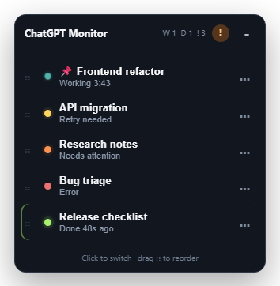
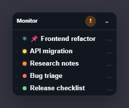
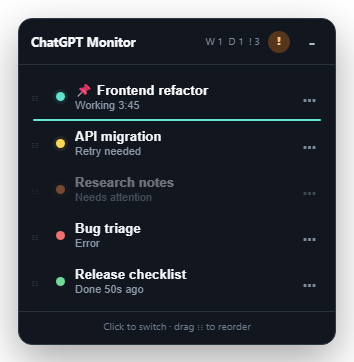
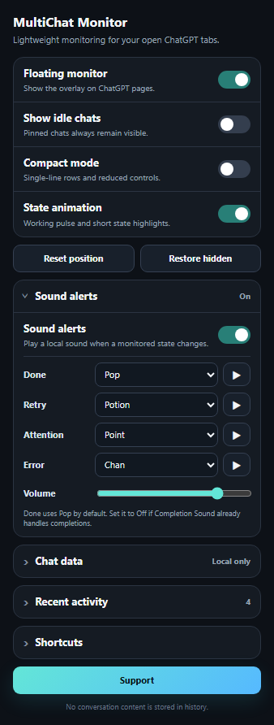
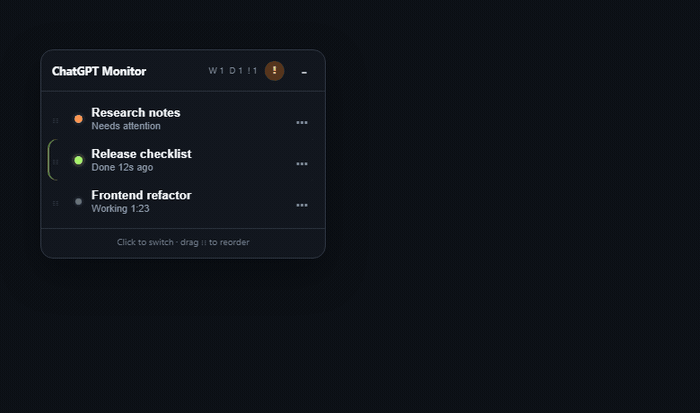
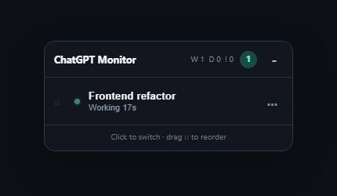
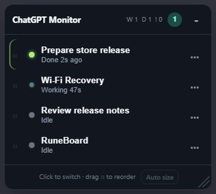

<p align="center">
  
</p>

<h1 align="center">ChatGPT MultiChat Monitor</h1>

<p align="center">
  Lightweight floating monitor for active ChatGPT conversations across browser tabs and windows.
</p>

<p align="center">
  <strong>Chrome / Edge · Manifest V3 · Local-first · No telemetry</strong>
</p>

<p align="center">
  <a href="https://github.com/JoelMomo/chatgpt-multichat-monitor/releases">
    
  </a>
  <a href="https://joelmomo.github.io/">
    
  </a>
</p>

## Preview

### Monitor

<p align="center">
  
</p>

<p align="center">
  <sub><strong>Normal view</strong> — live state, timers, unread Done and attention indicators.</sub>
</p>

### Compact mode

<p align="center">
  
</p>

<p align="center">
  <sub><strong>214 px compact view</strong> — the same information in single-line rows.</sub>
</p>

### Persistent chat order

<p align="center">
  
</p>

<p align="center">
  <sub>Drag a chat from its text area (name or status line), or use <strong>Move up / Move down</strong>. Separators are dragged directly by their line; chats inside each group keep smart state ordering.</sub>
</p>

### Settings

<p align="center">
  
</p>

<p align="center">
  <sub>Theme, opacity, sound alerts, compact mode, local chat data, recent activity and shortcuts.</sub>
</p>

## Live demos

<p align="center">
  <sub>Captured from the real extension UI using demo chat names and states.</sub>
</p>

### Floating and draggable

<p align="center">
  
</p>

<p align="center">
  <sub>Drag the header to place the monitor anywhere on screen. Its position is saved locally.</sub>
</p>

### Working → Done

<p align="center">
  
</p>

<p align="center">
  <sub>The cyan <strong>Working</strong> LED pulses while ChatGPT is generating, then switches to lime <strong>Done</strong>.</sub>
</p>

## What's new in 0.4.0

- **Auto size + manual resize:** the monitor follows the number of visible chats by default, while a custom size remains available whenever you drag the resize handle. The footer's **Auto size** button returns to chat-driven sizing and is hidden while the layout is locked. Auto-fit uses the panel's available height without introducing a second list cap, avoiding unnecessary scrollbars during normal state changes.
- **Appearance controls:** choose System, Dark, Light, Cozy, Neon or Minimal theme and adjust monitor opacity from the popup. Optional **Dim when inactive** fades the monitor until you hover or focus it.
- **Smart priority order:** chats automatically move by priority: Error → Retry → Attention → Done → Pending → Working → Stopped → Draft → Idle. Manual drag order behaves as before without separators; inside separator blocks, state priority remains active.
- **Pending:** right-click an Idle LED to mark a chat for follow-up. Pending uses a distinct pink LED, pulses much more slowly than Working, and stays marked locally until you clear it. The invisible LED hit target is larger than the visible dot for easier interaction.
- **Automatic project groups:** **By project** is now the default grouping mode. The extension detects ChatGPT project routes and sidebar links locally, creates project headers automatically and keeps **Other chats / No project** as safe fallbacks when membership is unavailable or absent. Project headers can be dragged to persist a custom project order, and chat text can be dragged to reorder chats inside the same project without changing ChatGPT project membership.
- **Active work timer:** Working chats show the visible ChatGPT phase when available (for example **Analizando / Analyzing**, search or tool execution) plus total active time. The start timestamp is persisted per conversation, so refreshing the same ChatGPT page restores the same timer instead of starting from zero; transient Draft transitions also keep the same active run. Done rows stay quiet and show only **Done**, without an age counter.
- **Cleaner project titles:** in **By project**, automatic chat titles omit a repeated `Project name ·` prefix because the project header already provides that context. Custom aliases remain unchanged.
- **Grouping modes:** choose **By project**, **Manual** or **None** in the popup. Manual separators are preserved when you temporarily switch modes.
- **Named, collapsible sections:** manual separators can be named with a double-click or their section menu, use a quiet `──── NAME ────` treatment, and can be collapsed. Automatic project groups can be collapsed too.
- **Section controls:** manual section menus include rename, clear name, collapse/expand, move up/down and delete. Collapsed sections show their chat count.
- **Section separators:** in Manual mode, add a separator from the monitor header and drag the separator itself wherever you want. Chats inside each resulting block continue to sort by state priority. Dragging highlights the destination section and empty/collapsed sections expose a temporary **Drop here** target.
- **Quieter counters:** Working, Done, Pending and Attention counts use low-opacity tinted circles with the number itself in the state color.
- **Safer layout editing:** a header **lock** toggles between open/closed states and prevents accidental layout edits while locked. Trying a blocked layout gesture—or a blocked reset from the popup—gives the closed lock a short visual shake so the reason is immediately clear. A normal click on a chat does not trigger the shake, and reduced-motion preferences disable it. The short-lived **Undo** action now appears as a compact header control instead of covering the monitor. **Reset layout** clears manual separators, project/manual ordering, assignments and collapse state while keeping aliases, pins, Pending and other chat preferences.
- **Version at a glance:** the normal monitor footer shows the current extension version; compact mode stays visually minimal and hides it.

<p align="center">
  
</p>

<p align="center">
  <sub>Captured from the real extension UI. <strong>Pending</strong> uses a slow pink pulse so it remains noticeable without looking active.</sub>
</p>

## What it does

ChatGPT MultiChat Monitor keeps a small floating panel on `chatgpt.com` and shares the status of your other open ChatGPT tabs.

- Live **Working** state with elapsed time. Detected work phases are kept canonical internally and displayed as **Analyzing / Searching / Executing** in English or **Analizando / Buscando / Ejecutando** in Spanish, following the current ChatGPT UI language rather than the source label that happened to be detected.
- Reload-safe timing for the current response: active start/phase timestamps are kept locally by conversation and restored before the refreshed page evaluates its state.
- **Done** stays lime until you actually visit that chat.
- A non-empty prompt composer is shown as **Draft** instead of Idle; active generation still remains **Working** while you prepare the next prompt.
- Detects recoverable **Retry needed** states, likely **Needs attention** responses and visible **Errors**.
- Click any row to focus the correct tab and browser window.
- Pin, hide or locally rename chats.
- Chats are grouped by their ChatGPT project by default. Project membership is detected from the current project URL, canonical URL or matching ChatGPT sidebar link; no project API or external service is used.
- In **By project**, each project is a named collapsible section. Drag project headers to choose their monitor order, or drag chat text to create a manual order inside the current project; a chat cannot be dragged into another ChatGPT project.
- In **Manual**, custom named separators and chat assignments are persistent. Inside each manual section, state priority remains active and manual order is the tie-breaker within the same state.
- In **None**, section headers are hidden and the existing global manual order remains available. Switching modes does not erase the stored manual sections.
- Idle chats are shown by default. Right-click an Idle LED to mark that conversation as **Pending**; right-click the pink Pending LED again to clear it.
- Auto-fitting overlay that follows the visible chats, while still supporting persistent manual resizing, compact mode and collapse.
- System / Dark / Light plus Cozy, Neon and Minimal themes, with adjustable opacity and optional hover-focus dimming.
- Per-state local sound alerts with volume and test controls.
- Small local recent-activity history.
- Browser badge and keyboard shortcuts for fast navigation.
- Lightweight GitHub release checks can notify manual-install users when a newer stable version is available.

## State legend

| State | LED | Meaning |
| --- | --- | --- |
| **Working** | Cyan, pulsing | ChatGPT is currently generating. |
| **Done** | Lime | Generation finished normally and has not been visited yet. |
| **Retry needed** | Yellow | A recoverable timeout, delivery/network problem or Retry action was detected. |
| **Needs attention** | Orange | The response likely ended with a question or request for user input. |
| **Error** | Red | A visible non-recoverable ChatGPT error was detected. |
| **Stopped** | Amber | Generation was manually stopped. |
| **Draft** | Violet | The prompt box contains unsent text and no higher-priority state is active. |
| **Pending** | Pink | Manually marked for follow-up. Right-click the LED to clear it. |
| **Idle** | Gray | No current or unread activity. Right-click its LED to mark it Pending. Hidden by default unless requested or pinned. |

A normal **Done** keeps only a short late-error grace window for detection; after that it remains lime without continuing error scans until you visit it.

## Multi-chat controls

- **Click** a row to switch to that conversation.
- In **Manual** or **None**, **drag anywhere in the chat text area** (name or status line) to reorder. Manual mode also lets you move a conversation between sections.
- In **Manual**, use the **separator** icon in the header to add a divider, then drag the separator itself to reorganize sections. Double-click it to name it.
- Drag a **project header** to reorder projects in the monitor. This changes only the monitor order, never the actual ChatGPT project.
- Click a named section caption to collapse/expand it. Project section captions work the same way; project names themselves come from ChatGPT and are not renamed by the extension.
- Use the header **open/closed lock** to protect the layout. While locked, drag/reorder, section editing/collapse, separator creation, panel movement and resizing are disabled; normal chat actions remain available.
- After an unlocked layout change, a small **↶ Undo** control appears temporarily in the header.
- **Right-click a section** or use its **...** menu for section actions. Manual sections support rename, clear name, collapse/expand, move up/down and delete.
- **Right-click** a chat row or use **...** for:
  - Set / rename alias
  - Pin / unpin
  - Clear alias
  - Move up / Move down
  - Hide
- **Reset chat order** clears manual chat ordering. **Reset layout** clears manual separators, section assignments and collapsed-section state without clearing aliases, pins, Pending or hidden-chat preferences.
- Automatic smart sorting prioritizes Error → Retry → Attention → Done → Pending → Working → Stopped → Draft → Idle.
- Pinned chats stay at the top of their current project/manual section, or the overall list when grouping is disabled.

## Sound alerts

Included local sounds:

- Pop
- Cash Register
- Chan
- Potion
- Point
- Page Turn
- Off

Default mapping:

| State | Default |
| --- | --- |
| Done | **Pop** |
| Retry needed | Potion |
| Needs attention | Point |
| Error | Chan |

Sound playback is event-driven. An offscreen audio document is created only when needed and closes after a short idle period.

## Browser badge

The extension icon stays quiet when nothing needs attention.

- A number shows how many chats are currently working.
- **!** means at least one chat needs attention, retry or error handling.
- **↑** means a newer stable GitHub release is available. Chat activity always takes priority over the update badge.

## Update notifications

For manual installations, the background service worker checks GitHub's public releases API at most once every 24 hours.

- Only stable, non-draft releases are considered.
- A newer version shows an **Update available** card in the popup.
- **View release** opens the corresponding GitHub release.
- **Dismiss** hides that specific version; a later version can notify again.
- After the extension itself is updated, a one-time **What's new** card links to that version's release notes.
- No conversation text, chat titles or activity history is included in the GitHub request.

Store-installed extensions can still use the browser's own automatic update mechanism; the built-in notice is primarily useful for manual GitHub installs.

## Keyboard shortcuts

| Shortcut | Action |
| --- | --- |
| `Alt+Shift+M` | Show / hide the monitor on the active ChatGPT tab |
| `Ctrl+Shift+1` | Focus the next working chat |
| `Ctrl+Shift+2` | Focus the next attention or unread Done chat |

Browser shortcut conflicts can be changed from the browser's extension shortcut settings.

## Lightweight design

The monitor is designed to stay open all day without continuously scanning conversation content.

- `MutationObserver` reacts to relevant DOM changes.
- Observer-triggered checks are throttled.
- Prompt-box input events update **Draft** immediately without scanning conversation content.
- The fast path checks ChatGPT's direct Stop signal.
- The broad button fallback runs only every 5 seconds.
- Retry/error detection checks capped sets of relevant visible elements only while useful.
- The **Needs attention** heuristic reads only the tail of the latest assistant response once when generation finishes.
- Live timer text updates only in visible browser tabs.
- Working animation uses a small opacity/transform pulse and can be disabled.
- Rows are updated in place instead of rebuilding the full overlay.
- Cross-tab state sync is event-driven; unchanged tabs do not send periodic heartbeat snapshots, and service-worker wakes rebuild state without reinjecting the content script.
- No continuous external polling and no telemetry.
- Update checks are opportunistic and throttled to at most one public GitHub releases request every 24 hours.

## Recent activity

The popup keeps a small local history:

- Maximum 100 events
- Maximum age 24 hours
- Title, state and timestamp only
- No response or conversation text stored

## Install

1. Open the latest GitHub release and download the `chatgpt-multichat-monitor-vX.Y.Z.zip` asset.
2. Extract the ZIP to a permanent folder.
3. Open `edge://extensions/` or `chrome://extensions/`.
4. Enable **Developer mode**.
5. Choose **Load unpacked**.
6. Select the extracted extension folder.
7. Reload existing ChatGPT tabs if required.

For development, clone this repository and load the repository root instead.

The extension also attempts to reinject itself into already-open ChatGPT tabs after an extension reload.

## Settings

The popup lets you:

- Enable / disable the floating monitor
- Show / hide idle chats
- Enable Compact mode
- Lock / unlock layout editing from the monitor header
- Choose **By project**, **Manual** or **None** chat grouping
- Choose System, Dark, Light, Cozy, Neon or Minimal theme
- Adjust floating monitor opacity from 35% to 100%
- Optionally dim the monitor while the pointer is away, restoring full configured opacity on hover/focus
- Disable state animations
- Reset the floating monitor position or custom size
- Restore hidden chats
- Clear local aliases or pins independently
- Reset manual chat order
- View or clear recent activity
- Configure and test per-state sound alerts
- Open the **Support** page

## Privacy

Public privacy policy: https://joelmomo.github.io/privacy/chatgpt-multichat-monitor/

The content script runs only on `https://chatgpt.com/*`.

It does not send conversation data to an external server. To detect activity it observes ChatGPT interface state. For the optional **Needs attention** classification, it reads only the end of the latest assistant response at the moment generation finishes. That text is not saved or transmitted.

The background service worker can make one public request to GitHub's releases API at most every 24 hours to discover the latest stable version. That request contains no conversation data or telemetry.

Stored data is limited to:

- Extension settings
- Local aliases / pin / hidden preferences
- Manual chat order
- Custom project order in the monitor
- Manual separator positions, names and per-chat section assignment
- Section collapsed/expanded state
- Grouping mode and layout-lock state
- Project membership/name detection stays local. Names are read from ChatGPT while tabs are open; collapsed project-section state is stored locally against the detected project identifier, not sent anywhere
- Recent activity metadata
- Session-only active response timing metadata used to restore a running timer after service-worker/page reloads; it is not kept as long-term browser storage
- Update-check timestamps, latest known release version and dismissed-version state
- One-time What's new acknowledgement state

## Limitations

ChatGPT does not expose a public browser API for conversation generation state, internal compute time or project membership. Activity, visible work phases and project grouping are inferred from the browser interface and ChatGPT's own URLs/sidebar links, so a future ChatGPT frontend change may require detector updates. Active response timing metadata is stored locally only while needed so refreshing the same conversation can restore the running timer.

**Needs attention** is intentionally conservative and heuristic. A response ending in a question can be classified as attention even when a reply is not strictly required.

## Development

Static checks:

```powershell
node --check background.js
node --check content.js
node --check popup.js
node --check offscreen.js
Get-Content -Raw manifest.json | ConvertFrom-Json
git diff --check
```

## Support development

These projects are free to use and developed in my spare time. If they've been useful to you, you can help support future development.

<p>
  <a href="https://github.com/sponsors/JoelMomo">
    
  </a>
  <a href="https://ko-fi.com/joelmomodev">
    
  </a>
</p>

<sub>All projects remain free regardless of support.</sub>

## License

MIT
